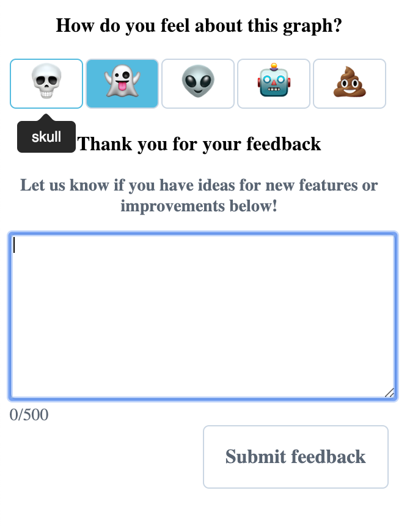

[](https://standardjs.com)
[](https://github.com/facebook/jest)
[](https://img.shields.io/badge/gzip%20size-6.4kB-green.svg)
[](http://vanilla-js.com/)

# Emoji-Feedback 💀 👻 👽 🤖 💩 (in active development)

[Working Prototype](https://jsfiddle.net/justin0022/pd4oczva/18/)


A delightful tool for eliciting feedback via emojis, featuring a feedback form. 0 dependencies, written in pure vanilla JavaScript.

## Getting Started

These instructions will get you a copy of the project up and running on your local machine.

### Prerequisites

1. **Install [Node 8.0.0 or greater](https://nodejs.org)**.
2. **Install [Git](https://git-scm.com/downloads)**.

### Installing and Setup

1. First, clone this repo. `git clone https://github.com/ubc/emoji-feedback.git`
1. Then cd into the repo. `cd emoji-feedback`
1. Run the installation script. `npm install` (If you see `babel-node: command not found`, you've missed this step.)
1. Run using `npm start`. Webpack Dev Server will host a hot-loading webpage.
1. To build for production, `npm run build` will output the production-ready, minified, tree-shaken bundle in `/dist`.

### Usage
Emoji-Feedback can be installed via `npm`. Since this app requires the DOM, it will not run via Node. I highly recommend using something like Webpack or Rollup to produce a bundle that will be executed by the browser.
`npm i @justin0022/emoji-feedback`
```javascript
const emojiFeedback = require('@justin0022/emoji-feedback')
const app = emojiFeedback()

const endpoints = {
  emoji: 'http://127.0.0.1:5000/emoji',
  feedback: 'http://127.0.0.1:5000/feedback',
  votes: 'http://127.0.0.1:5000/votes'
}

app.init('entry', endpoints, {
  // introText: 'I can customize this!',
  // feedbackTextPrompt: 'Please write down below',
  // feedbackThankYou: 'Thanks again!',
  // emojis:
})
```
`emojiFeedback` has one method, `init`. Init takes 3 arguments: `entry`, `endpoints`, `options`
* `entry` is the HTML id attribute that should be unique to the document. This is the entry point of Emoji Feedback.
* `endpoints` is an object that contains 3 endpoints `emoji`, `feedback` and `votes`. `emoji` and `feedback` send POST requests that contain the selected emoji(s) and the written feedback in the body of the request, respectively. `votes` sends a GET request for retrieving the number of times students have voted.
* `options` is an optional object that contains `introText`, `feedbackTextPrompt`, `feedbackThankYou`, which allow for configurations of the text, as well as `emojis`, which can be used to configure the emojis to your liking. For example,

```javascript
const myConfiguredEmoji = [
  { emojicon: '💀', emotion: 'skull' },
  { emojicon: '👻', emotion: 'boo' },
  { emojicon: '👽', emotion: 'alien' },
  { emojicon: '🤖', emotion: 'robot' },
  { emojicon: '💩', emotion: 'poop' }
]
app.init('entry', endpoints, {
   emojis: myConfiguredEmoji
})
```



### Tests
To run the tests, first ensure that the application is running locally (`npm start`), then `npm test` will run the Jest unit and UI tests (in Puppeteer's headless mode).
If the app is not running locally, then the UI tests will fail, as they rely on the DOM.
Code coverage is >90%, and more tests will be added over time.
